# PROJECT DOCUMENTATION

## Step 1: BACKEND CONFIGURATION

#### Command: sudo apt update (update ubuntu packages)
#### Output:

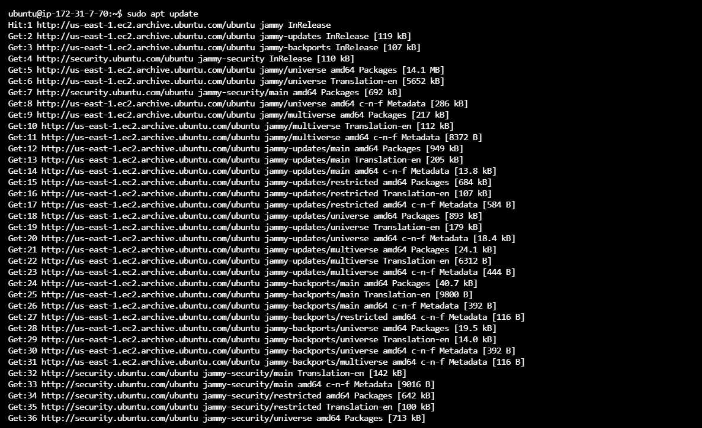

#### Command: sudo apt upgrade (upgrade ubuntu)
#### Output:

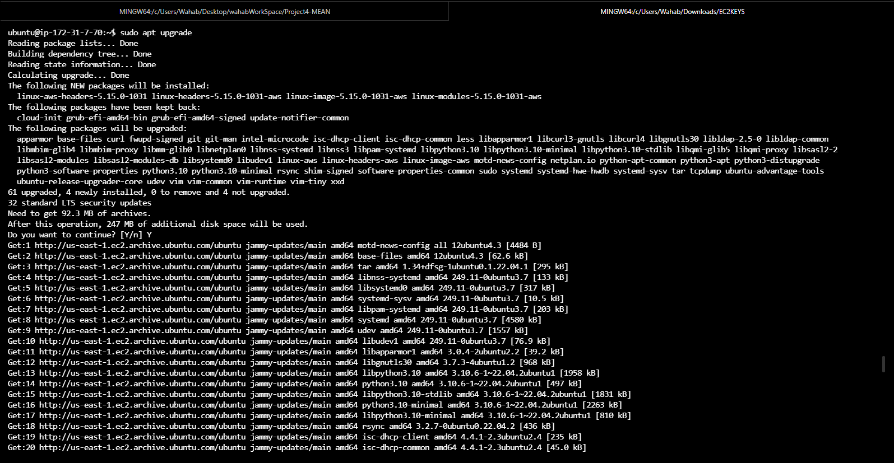

#### Command: sudo apt -y install curl dirmngr apt-transport-https lsb-release ca-certificate (Add Certificate)
#### Output:

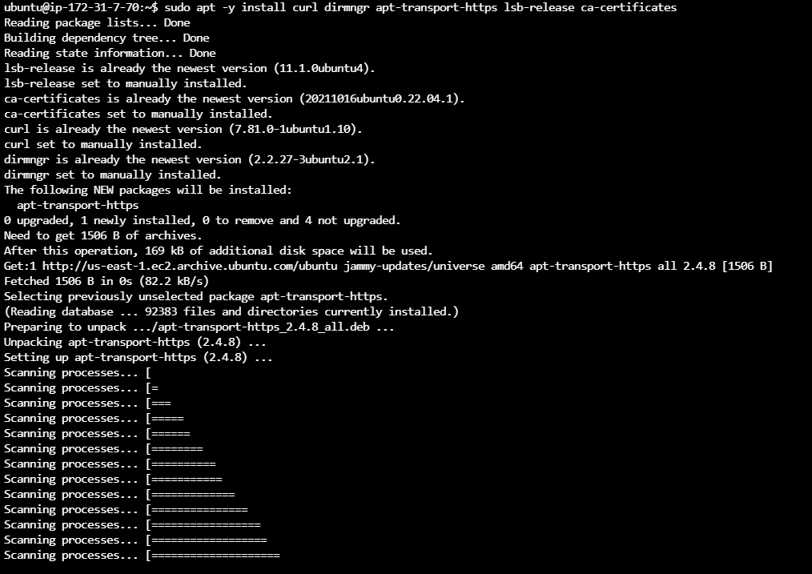

#### Command: curl -fsSL https://deb.nodesource.com/setup_18.x | sudo -E bash - (getting node.js location from ubuntu)
#### Output:

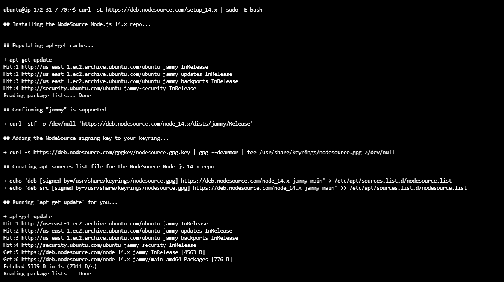

#### Command: sudo apt-get install -y nodejs (installing node and npm)
#### Output:

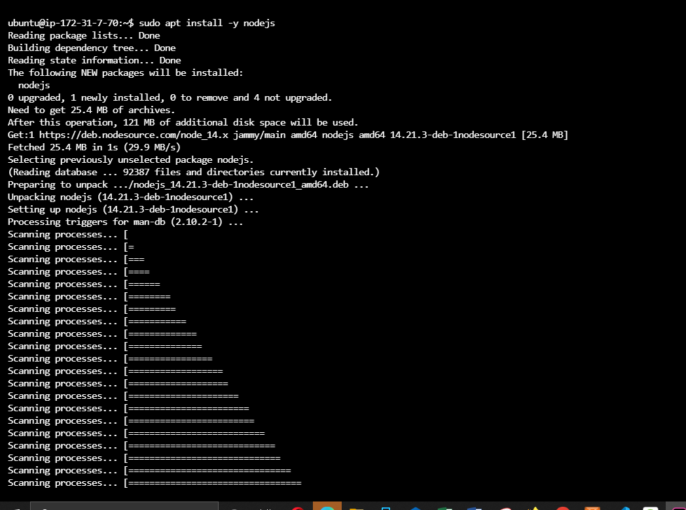

## STEP 2:  MongoDB Installation
#### Checking if service is up and running

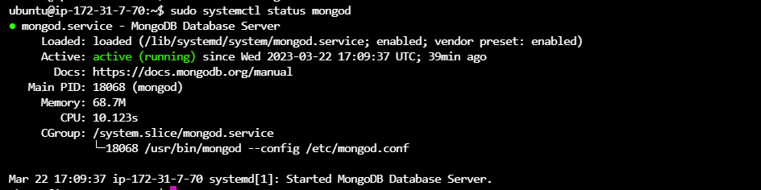

#### Body-Perser Installation

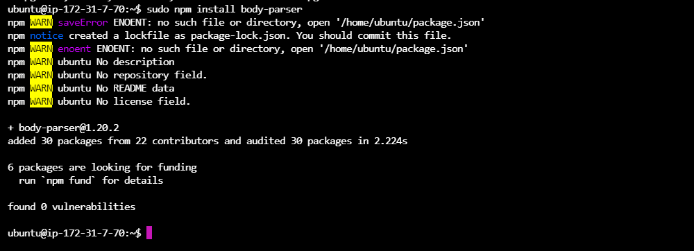

#### Create a Books Directory and run npm init.

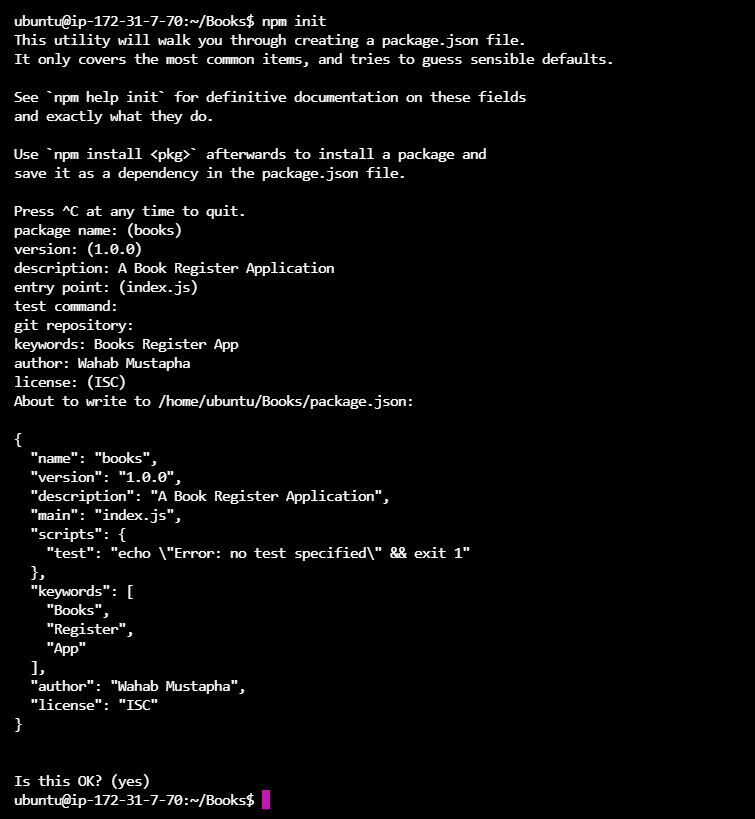

#### Create a server.js file

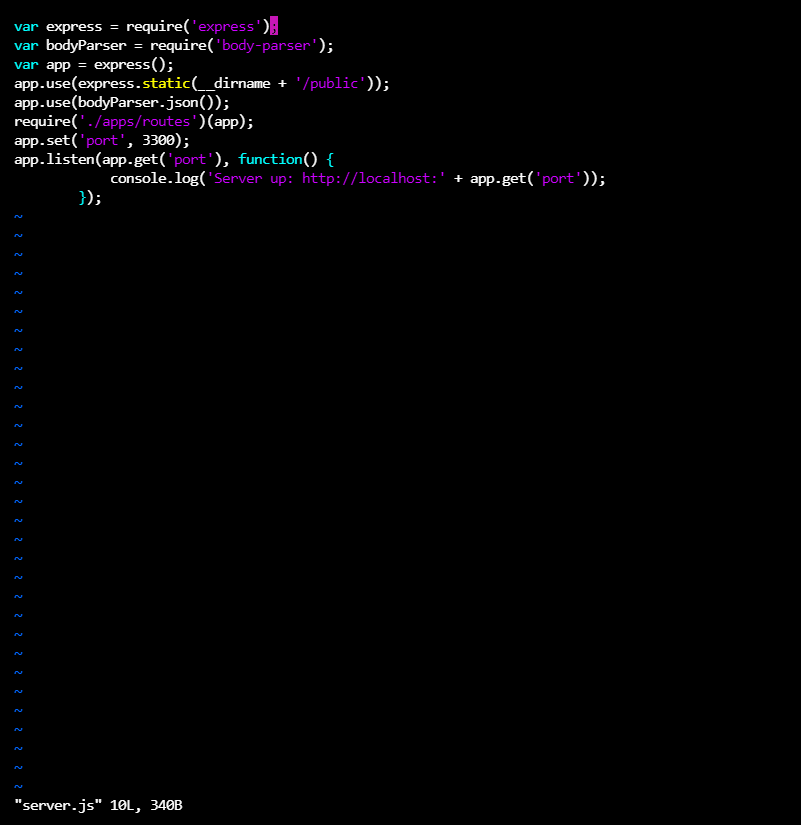

## STEP 3: INSTALL EXPRESS AND SET UP ROUTES TO THE SERVER

#### Express and Mongoose Installation
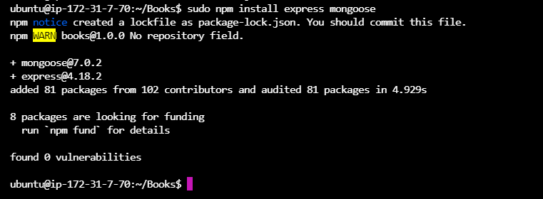

#### create routes.js file in apps directory

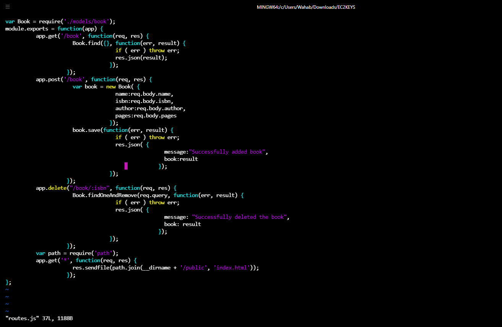

#### create book.js file in models directory

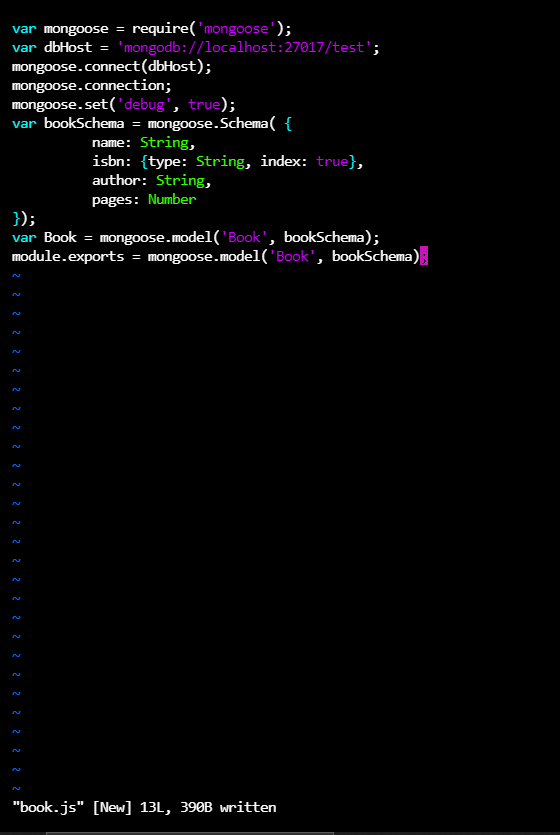

## STEP 4: ACCESS THE ROUTES WITH ANGULARJS

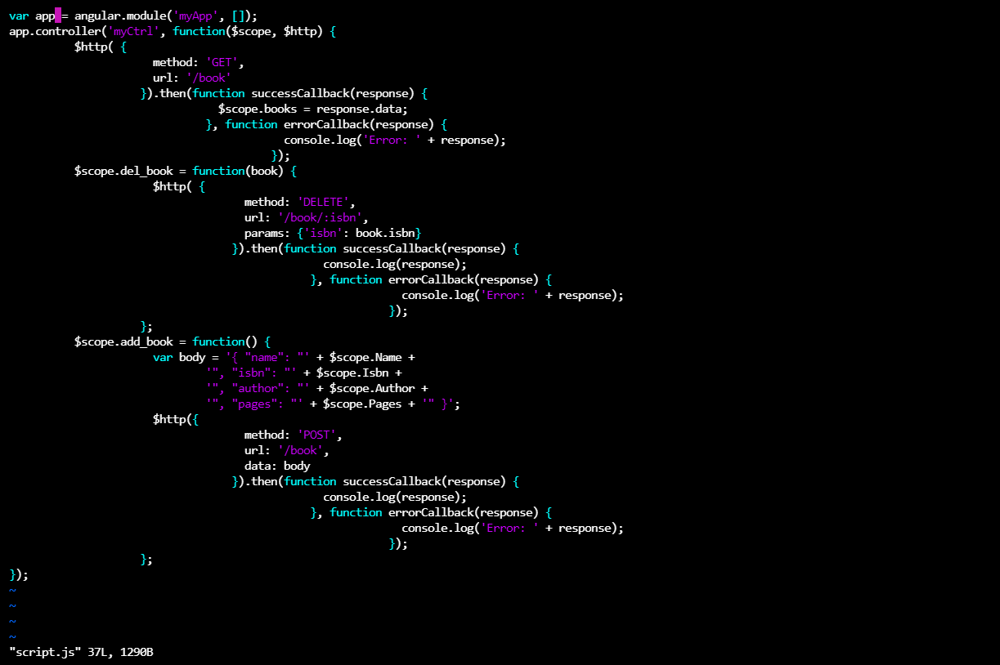

#### Create index.html File

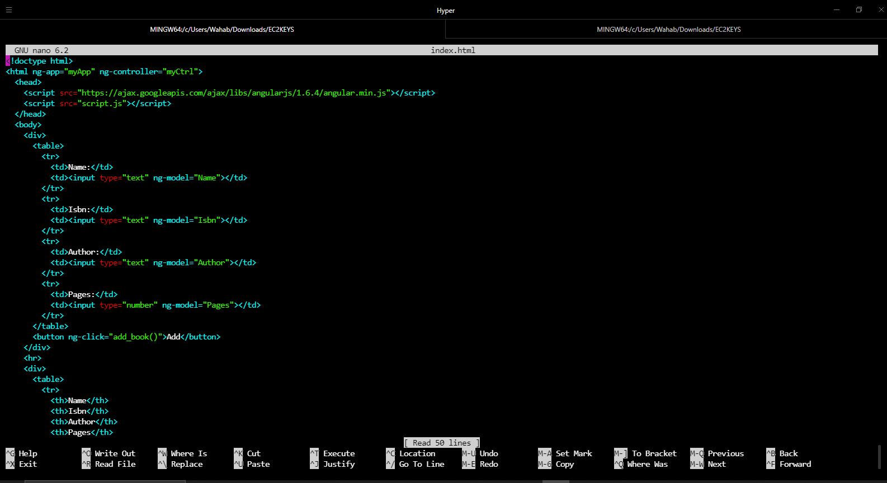

#### Modify the route.js file using asyn/wait callback of javascript for all the end point to work (i.e Get, Post and Delete)

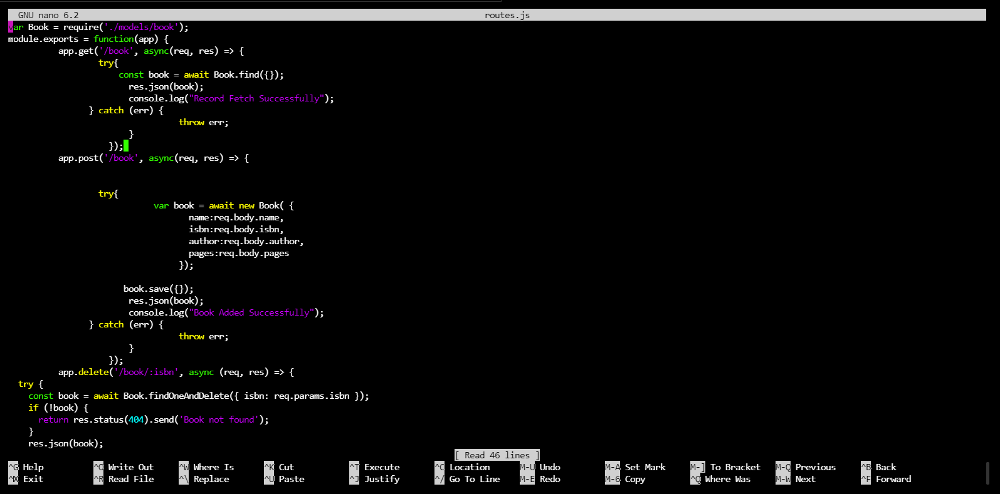

#### Add Port 3300 to inbound rule of Security Group.

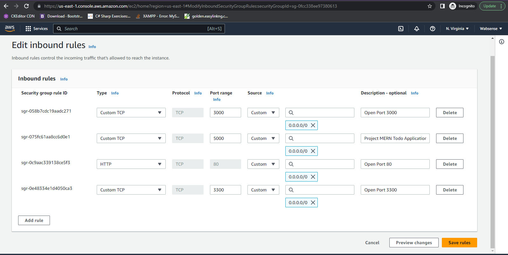

#### Start server

#### Access via Browser

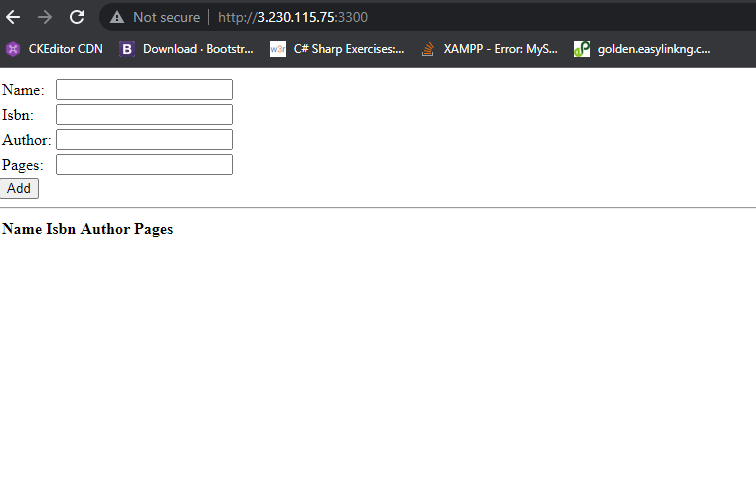

#### Add a new book
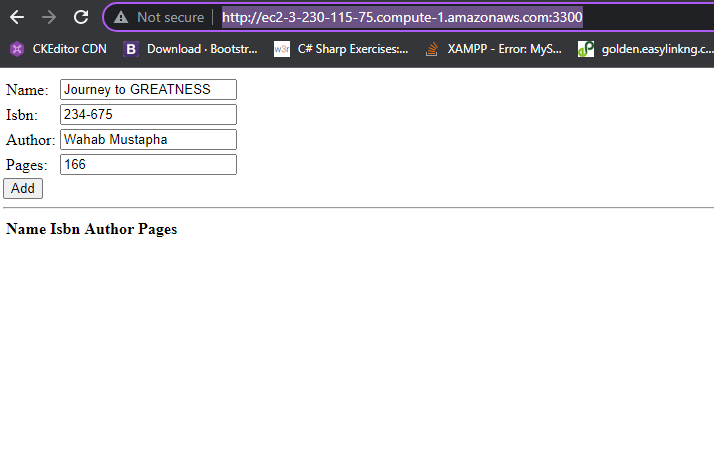

#### Terminal Output

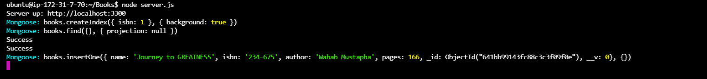

#### Add a new book
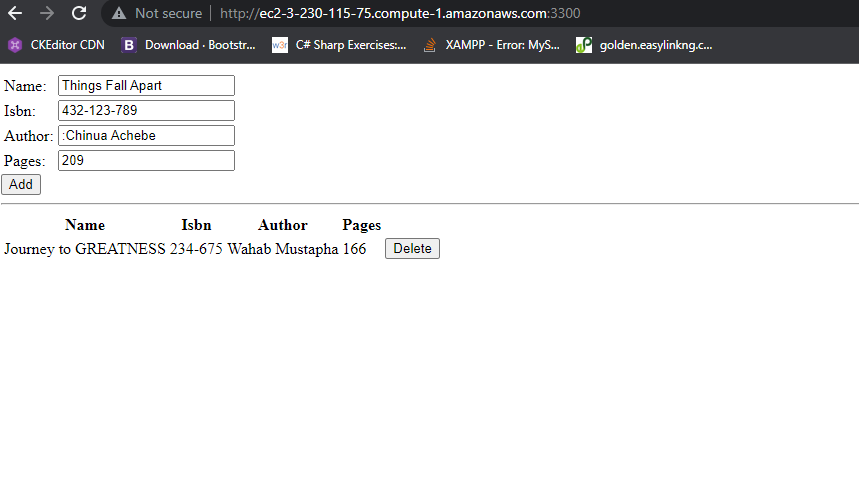

#### Terminal Output
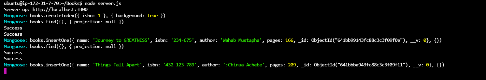

